# Creating an AWS EC2 instance(scalable cloud VM) for our local monolith(our app and database VMs):


## Creating our EC2 instance:

!!! Note: Make sure our account always has `Ireland(eu-west-01)` as location.

1. Search EC2.

2. Select EC2 and `launch an instance`.

### Configuring our instance:

3. Name your instance. Best practice: name_group_ReasonForUse

- in my case: `florina-tech201-app`(because we are creating an instance first, for our `app` VM).

4. Select the OS needed. In my case Ubuntu 18.04.

5. Select the instance type. In my case, `t2.micro`.

6. Select a key pair for this instance. In my case, select the key I received to be able to access this instance and that I further stored within the `.ssh` folder on my local host.

!!! Note: If a key matches a pair, the system copies the key and stores it on the other end point, so you do not need to check again.
 

7. Network settings:

1. Allow SSH Traffic - Only my IP.
2. Allow HTTP traffic from the internet(HTTPS - mainly used in production, when the site needs to be secure).

3. Go to Edit( Create a security group so we can use it another time as well): 
- VPC - default
- Subnet - Default subnet recommended.
- Auto-assign public IP - Enable (if it is an instance that should not be accessible- Disable)
- Firewall - Create security group.
- Security group name - FLORINA-TECH201-APP(we create this firewall for our app VM only)
- Security group description - The same as the Security group name + any other important things we need to mention.
- Sec rule 1 - ssh- My IP
- sec rule 2  - HTTP - Anywhere
- sec rule 3 (must be added -  Add Security group rule) - Custom TCP - Anywhere - 3000 - For Node App


8. Configure storage:
- Currently default

9. Summary:
- Need to make sure it matches the configuration we just made. 

10. Launch the instance.

11. Click the ID to get to the dashboard and see the created instance.

## Entering the EC2 instance we have just created


- We created the instance, and the system will run some checks in the background, especially checking if the connection code is `200`. If that is the case, the instance will show on the dashboard as `Running`.
- Now, we have to make sure we did the correct configurations and everything worked as expected. So we need to enter the instance through our local computer.
- So, in order to get in the machine, we need to be able to SSH in the machine.
1. Select your instance, and click `Connect` button at the top.
2. It will take us to a menu with some information and instructions.
3. Let`s go on the SSH Client tab and we can see the information re. our session ID, the key location, and commands to enter the VM through terminal.
4. Lets go to git bash terminal on our local host.
5. Go in the folder where we have the access key to connect to the instance: should be in the `.ssh` folder.
6. Run `chmod 400 YourKeyFile.pem` to ensure your key is not publicly viewable.
7. Then `ssh -i "YourKeyFile.pem" ubuntu@yourInstancePublicDNS.com`
8. Run `sudo apt-get update-y`
9. Run `sudo apt-get upgrade -y`
10. Run `sudo agt-get install nginx -y`
11. Copy and paste your I.P. address from the EC2 Instance Connect tab, into a web browser, and should be able to see the `Welcome to nginx!` web page.

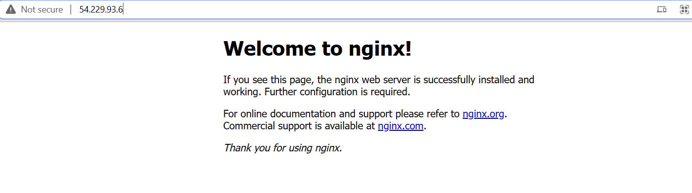


!! Note: If you get a `Connection timed out` error - it is a port 22 issue. That means, that your computer might have a Dynamic IP address.

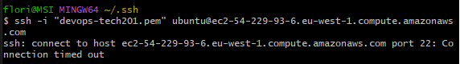

- Go to your Instance`s Security.
- Access your Security Group.
- Edit your security group configurations: On port 22: Switch to `My IP` (if not already configured like that).
- Should now work, and you should be able to `ssh` in the instance through your bash terminal.


## Migrating our `app` folder to our EC2 Instance and running our app on the cloud

- Migrating a folder to your EC2 AWS instance can be done by using the `scp` method.
- In order to do that, first open a `git bash` terminal, and go into the .ssh folder to run the following command.

```
scp -i devops-tech201.pem -r <absolute path of your folder> ubuntu@<your_instance_public_DNS>:/home/ubuntu
```

- It will take a very long time to copy everything, depending on how many files you have within the foder you are migrating.
- However, when it is done, you should simply be aple to run `ls` and see the folder you have just migrated.

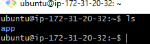

- Now that our app folder is within out EC2 instance, we can check if nginx and node.js are installed:

```
nginx -v
node -v
```

- Make sure that our Reverse Proxy settings are properly set by accessing the default file :

```
sudo nano /etc/nginx/sites-available/default # check if the `location` configuration mentions the port :3000 for proxy_pass.
```
- Run: 
```
sudo apt-get install npm

node app.js 
```
- Now, you should be able to access your ap via the I.P. address of you EC2 instance, without having to mention the port number!

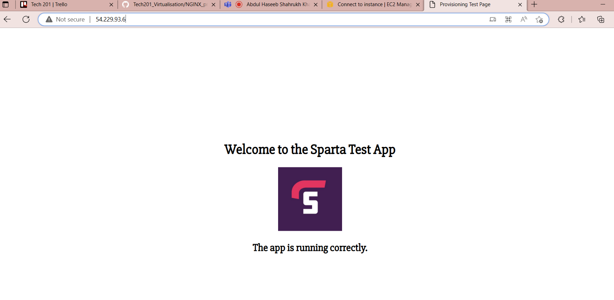

--- 

## Tier 2 architecture - Deploying our `database` VM on EC2

- In order to be able to deploy our 2tier architecture, we need to make sure our `database` EC2 instance (our second tier) is set properly on a separate instance than the `app`(our first tier), by following the next requirements. 
- If everything is set properly, we should be able to get the two tiers communicating and we then have successfully deployed a 2tier architechture from a local monolith.

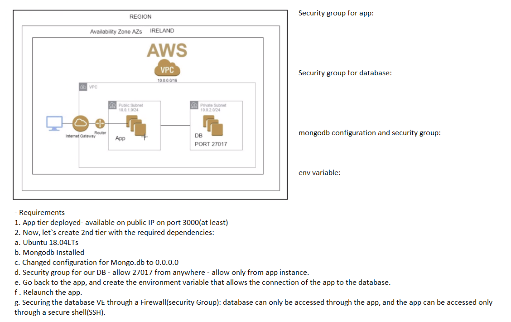

### Requirements
1. App tier deployed- available on public IP on port 3000(at least)


2. Now, let`s create 2nd tier with required dependencies:
a. Ubuntu 18.04LTs
b. Mongodb Installed
c. Changed configurtion for Mongo.db to 0.0.0.0
d. Security group for our DB - allow 27017 from anywhere - allow only from app instance.
e. Go back to the app, create the environment variable that allows the connection of the app to the database.
f . Relaunch the app.
g. Securing the database VE through a Firewall(security Group) : database can only be accessed through the app, the app can be accessed only through a secure shell(SSH).

- After we created the instance with the required OS, we can ssh within the `database` instance and continue with configuring the other dependencies.
```
 ssh -i key_file.pem ubuntu@<your instance public DNS>

```
- Once inside the EC2 instance, we need to get the provision file for the `database` VM we created locally, so we can provision our EC2 database instance with the same dependencies as our locally created VM.
- We can do that either by using the `scp` commad we used previously to migrate the `app` folder within our `app` EC2 instance, or we can copy the file in our `database` EC2 instance by cloning the repository that contains the specific file and run it within our EC2 instance. 
- If we want to use the `clone` method, simply run 
```
git clone <http of the repository where we have the database provision file>

# navigate within the repo to the folder that holds the provision file for database

# then change the permission for the provision file so it is executable

sudo chmod +x <provisionfile.sh>

# run the file so you can implement the dependancies

sudo ./provisionfile.sh

# check that mongodb is up and running by checking its status

sudo systemctl status mongod
```
- If everything went well, you should be getting `active` as a status.

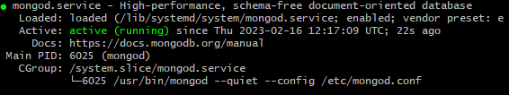

!!! Note: You might encounter issues if your provision.sh file containt specific changes for the mongodb configuration. 

- For example, my provision file initially specified some changed to the network configurations for mongo.db. Those specific configuration changes need to be commented out in the provision.sh file, as they will create issues when running the provision file within our EC2 instance.
- So, before running the provision file, make sure you run:
```
sudo nano <provisionfile.sh> # in order to comment out any specific configuration changes and have only the basic installation and enablement for mongo.db
```
- As a result, your provision file, before running it, should look like this:

```
sudo apt-key adv --keyserver hkp://keyserver.ubuntu.com:80 --recv D68FA50FEA312927

echo "deb https://repo.mongodb.org/apt/ubuntu xenial/mongodb-org/3.2 multiverse" | sudo tee /etc/apt/sources.list.d/mongodb-org-3.2.list

sudo apt-get update -y
sudo apt-get upgrade -y

sudo apt-get install -y mongodb-org=3.2.20 mongodb-org-server=3.2.20 mongodb-org-shell=3.2.20 mongodb-org-mongos=3.2.20 mongodb-org-tools=3.2.20

sudo systemctl restart mongod
sudo systemctl enable mongod

```
- If your provision file contains the previous commands, your mongodb shoud be up and running as expected when checked with:
```
sudo systemctl status mongod
```

- Lastly, we will have to change the configurations for mongo.db to allow the database to be accessed from anywhere, as long as it is accessed through the `27017` port. This would be the same as we did in ptovision file, only we will do it manually to make sure everything works as required. 

```
sudo nano /etc/mongod.conf
# go to the network interface section and replace the current bindIP with 0.0.0.0

```
- After we change the bidIP, we have to make sure we restart and re-enable mongo.db:

```
sudo systemctl restart mongod
sudo systemctl enable mongod
```
- Now, our database should be ready and accesible through port 27017.

---


## Tier 2 architecture - Connecting our `app` and `database` EC2 instances

- Now, that we have our `app` Ec2 instance set up and running properly, and the `database` EC2 instance with mongo.db active and allowing connections through port 27017, we only have to create an env variable wthin the `app` Ec2 instance that will connect us to the database.
- Just like we previously did locally, let`d first make sure the app is running properly.
```
ssh -i <key_file.pem> ubuntu@<your instance public DNS>

cd app/

npm install

node app.js

#these will allow us to check that first, our app is working as expected

```

- Now that our app is up and running, we need to create an env variable (at first we will not make it persistent, just because we want to make sure the connection is successful before we make the variable persistent).

```
export DB_HOST=mongodb://<database ip address>:27017/posts

printenv DB_HOST # to check the env variable has been set correctly

cd app/

npm install

node seeds/seed.js

node app.js
```
- If everything was set up correctly, you should be able to see the posts page.

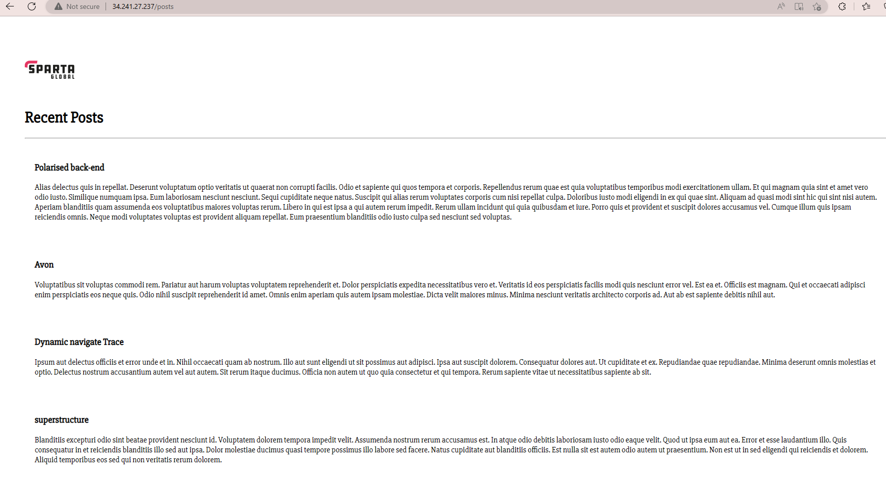

---

## Creating an AM for our `app` EC2 instance

- Creating AMIs for our  Ec2 instances can help save the company money (in terms of storage) due to the fact that instead of having an EC2 instance that could be running while not used, we can create an AMI (an image of the state of the EC2 instance) that can allow us to launch an instance with the same template and at the same stage as our `app` instance, whenever we need to use it again.

- In order to create an AMI, we need to select the `Action` tab at the top of the AWS page of our instance that we want to crate an AMI for:

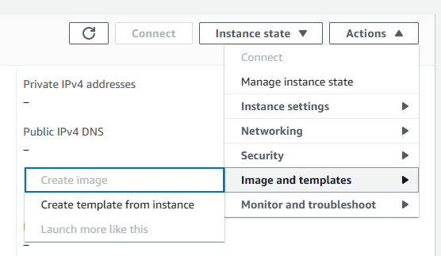

- Select `Image and templates` and further select `Create image`.
- This will takes us to a page similar to the page where we created an EC2 instance, where we have to mention the name of our AMI and the description.
- Best practice would be to name your AMI after your EC2 instance that you create an AMI for + AMI at the end.
- When it comes to the description, copy + paste the name you assigned it, and mention things like ports allowed, just to give information to the user about what the AMI is a template of. 
- When ready, simply press `Create image`. It will be in the `Pending` status for a while as it has to cpy all the information from the EC2 instance. 
- Once finished, feel free to delete the EC2 instance if no longer needed or in use. 
- To access all your created AMIs, simply navigate the left-side menu.

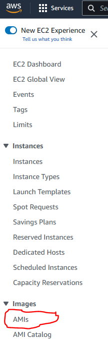

---

## Creating an AMI for our `database` EC2 instance

- Exactly as we did for the `app` EC2 instance, we will now create an AMI for our `database` EC2 instance.
- So, once again, select `Image and templates` and further select `Create image`.
- Name the AMI accordingly e.g. "name-class-ami" and in the description copy and paste the name and add details that would be useful (e.g. litening on port 27017-in the case of the database).
- Select `Create image`. Once the status is `Avaialble`, feel free to terminate your `database` EC2 instance. 
- Together with the AMI from the `app` EC2 instance, if you now go to the Images tab in the left-side menu, you should be able to see your AMIs.

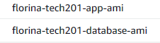

---

## Launching instances from AMI (both for `app` and `database`)

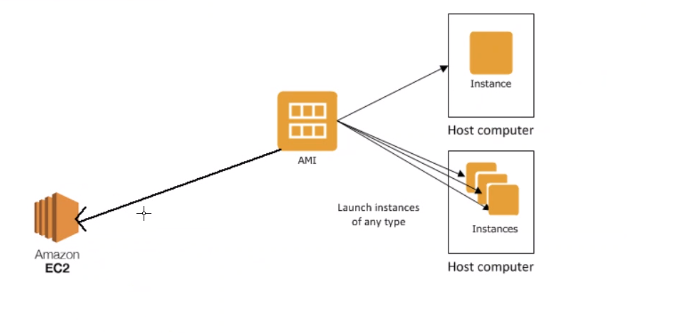


- Now that we have Images f our EC2 instances, and we have terminated both the `app` and `database` EC2 instances, we can recreate the instances by using the AMIs we just created.
- Go in the Images tab on the menu on the left hand side of the AWS web page.
- Selected the `app` AMI and click on the AMI ID.
- This will open a new web page with the details of the AMI. 
- Select `Launch instance from AMI`.

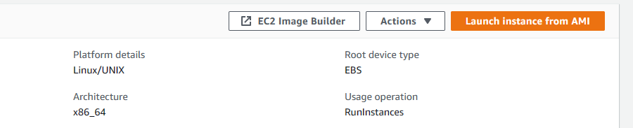

- Just like when we created the original EC2 instance for our `app` virtual environment, selecting `Launch instance from AMI` will prompt us on a new web page where we have to select the key, the security group, etc.
- We will have to select a name, the OS will be already selected de to the fact that this EC2 instance is being created after a template.
- We will have to select a key, which will be the same key we used for the original EC2 instance.

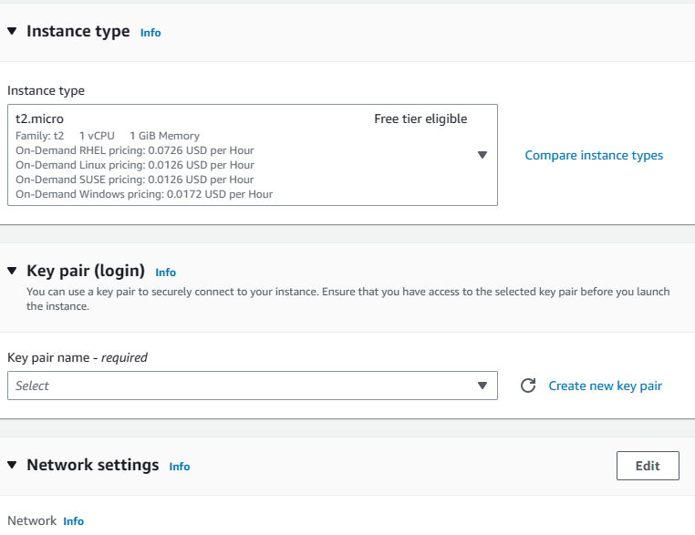

- And, in terms of Network settings, we can simply select `Select existing Security group` and pick the security group we created for our `app` EC2 instance.
- Then, we can just `Launch Instance` and we will have a new EC2 instance created from an AMI.

### !!! Note: For our `database` AMI we should follow the same instructions in order to launch an EC2 instance after the `database` AMI.

---

## Launching and connecting our EC2 instances created from AMIs

- Now that we have created new EC2 instances from AMIs from our `app` and `database` initial EC2 instances, we only have to `ssh` into both instances, check that everything is set and running accordingly.

1. In our `database` EC2 instance:
- Check that our network configurations are correct and allow connection from port 27017:
```
sudo nano /etc/mongod.conf

#should say bandIP: 0.0.0.0
```
- Check that mongodb is up and running correctly :
```
sudo systemctl status mongod
```


2. In our `app` EC2 instance:
- Check that we have `nginx` and `node` installed and with the correct versions:
```
nginx -v

node -v

```

- Check that our reverse proxy is correctly set with the right cnfiguration:

```
sudo nano /etc/nginx/sites-available/default
```
- Check that we don t have an env variable and set it up:
```
export DB_HOST=mongodb://<database EC2 instance IP>:27017/posts
```
- Install and launch the app to make sure it is running and connecting to the database:
```
cd app/

npm install

node seeds/seed.js

node app.js
```

- If everything went right, you should be able to see the app running and connecting to the database:

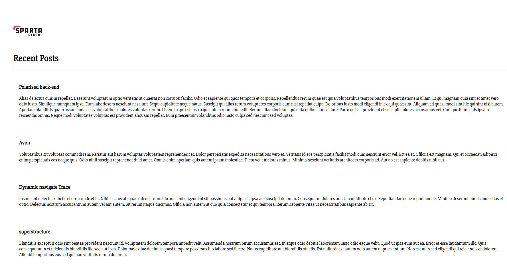

---

## Setting a monitoring and alerting alarm for our `app` EC2 instance.

- Setting up an Alarm for our system can be very beneficial in monitoring our app 24/7 and ensuring that everything is up an drunning as expected. We can set certain actions to be followed when the Alarm goes off, but for practice purposes, we will simply set an alarm to send us an email when the CPU Utilisation in our EC2  instance has reached a certain treshhold. 

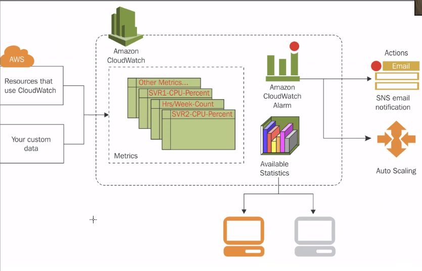

-

- In order to set up an alarm for our `app` EC2 instance, in my case that monitors the CPU-Utilisation, we simply need to follow some steps. 
First, we need to go into the dashboard of our instance, select `Monitoring`, and further Select `Manage detailed monitoring` where you will have to tick the `Enable` box. 

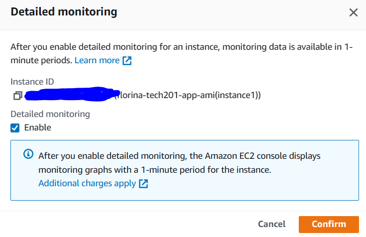

[Creating a CPU alarm for an EC2 instance](https://docs.aws.amazon.com/AmazonCloudWatch/latest/monitoring/US_AlarmAtThresholdEC2.html)

- First, we need to access the Amazon CloudWatch dashboard. 
- Go to `Alarms` tab on the left hand side of the dashboard.
- Further select the option `All alarms`.
- Select `Create Alarm` and proceed to follow the above instructions step by step.
!! Note: when prompted to select an SNS topic for alarm, please make sure to first create a new topic containing your Email as the communication endpoint in order to make sure that you receive the Alarm went it goes off. 
- When finished, please make sure to head back to the AWS CoudWatch Dashboard in order to check that everything went well in terms of set up.
- If everything went well, you will also receive an email from AWS mentioning your subscritption for the monitoring service as a confirmation for your alarm creation.


