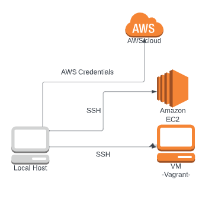
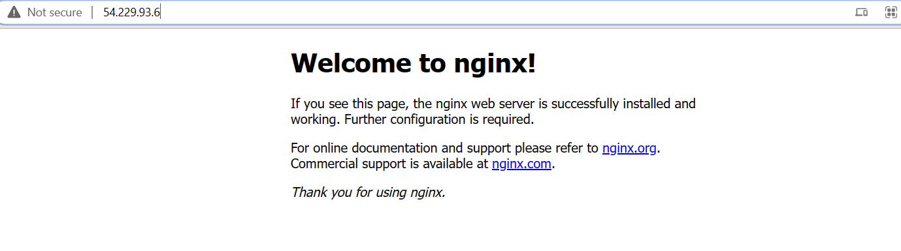
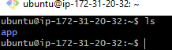

# Creating an AWS EC2 instance(scalable cloud VM) for our local monolith(our app and database VMs):

!!! Note: Make sure our account always has `Ireland(eu-west-01)` as location.



1. Search EC2.

2. Select EC2 and `launch an instance`.

### Configuring our instance:

3. Name your instance. Best practice: name_group_ReasonForUse

- in my case: `florina-tech201-app`(because we are creating an instance first, for our `app` VM).

4. Select the OS needed. In my case Ubuntu 18.04.

5. Select the instance type. In my case, `t2.micro`.

6. Select a key pair for this instance. In my case, select the key I received to be able to access this instance and that I further stored within the `.ssh` folder on my local host. 

7. Network settings:

1. Allow SSH Traffic - Only my IP.
2. Allow HTTP traffic from the internet(HTTPS - mainly used in production, when the site needs to be secure).

3. Go to Edit( Create a security group so we can use it another time as well): 
- VPC - default
- Subnet - Default subnet recommended.
- Auto-assign public IP - Enable (if it is an instance that should not be accessible- Disable)
- Firewall - Create security group.
- Security group name - FLORINA-TECH201-APP(we create this firewall for our app VM only)
- Security group description - The same as the Security group name + any other important things we need to mention.
- Sec rule 1 - ssh- My IP
- sec rule 2  - HTTP - Anywhere
- sec rule 3 (must be added -  Add Security group rule) - Custom TCP - Anywhere - 3000 - For Node App


8. Configure storage:
- Currently default

9. Summary:
- Need to make sure it matches the configuration we just made. 

10. Launch the instance.

11. Click the ID to get to the dashboard and see the created instance.

## Entering the EC2 instance we have just created


- We created the instance, and the system will run some checks in the background, especially checking if the connection code is `200`. If that is the case, the instance will show on the dashboard as `Running`.
- Now, we have to make sure we did the correct configurations and everything worked as expected. So we need to enter the instance through our local computer.
- So, in order to get in the machine, we need to be able to SSH in the machine.
1. Select your instance, and click `Connect` button at the top.
2. It will take us to a menu with some information and instructions.
3. Let`s go on the SSH Client tab and we can see the information re. our session ID, the key location, and commands to enter the VM through terminal.
4. Lets go to git bash terminal on our local host.
5. Go in the folder where we have the access key to connect to the instance: should be in the `.ssh` folder.
6. Run `chmod 400 YourKeyFile.pem` to ensure your key is not publicly viewable.
7. Then `ssh -i "YourKeyFile.pem" ubuntu@yourInstancePublicDNS.com`
8. Run `sudo apt-get update-y`
9. Run `sudo apt-get upgrade -y`
10. Run `sudo agt-get install nginx -y`
11. Copy and paste your I.P. address from the EC2 Instance Connect tab, into a web browser, and should be able to see the `Welcome to nginx!` web page.




!! Note: If you get a `Connection timed out` error - it is a port 22 issue. That means, that your computer might have a Dynamic IP address.


- Go to your Instance`s Security.
- Access your Security Group.
- Edit your security group configurations: On port 22: Switch to `My IP` (if not already configured like that).
- Should now work, and you should be able to `ssh` in the instance through your bash terminal.


## Migrating our `app` folder to our EC2 Instance and running our app on the cloud

- Migrating a folder to your EC2 AWS instance can be done by using the `scp` method.
- In order to do that, first open a `git bash` terminal, and go into the .ssh folder to run the following command.

```
scp -i devops-tech201.pem -r <absolute path of your folder> ubuntu@<your_instance_public_DNS>:/home/ubuntu
```

- It will take a very long time to copy everything, depending on how many files you have within the foder you are migrating.
- However, when it is done, you should simply be aple to run `ls` and see the folder you have just migrated.



