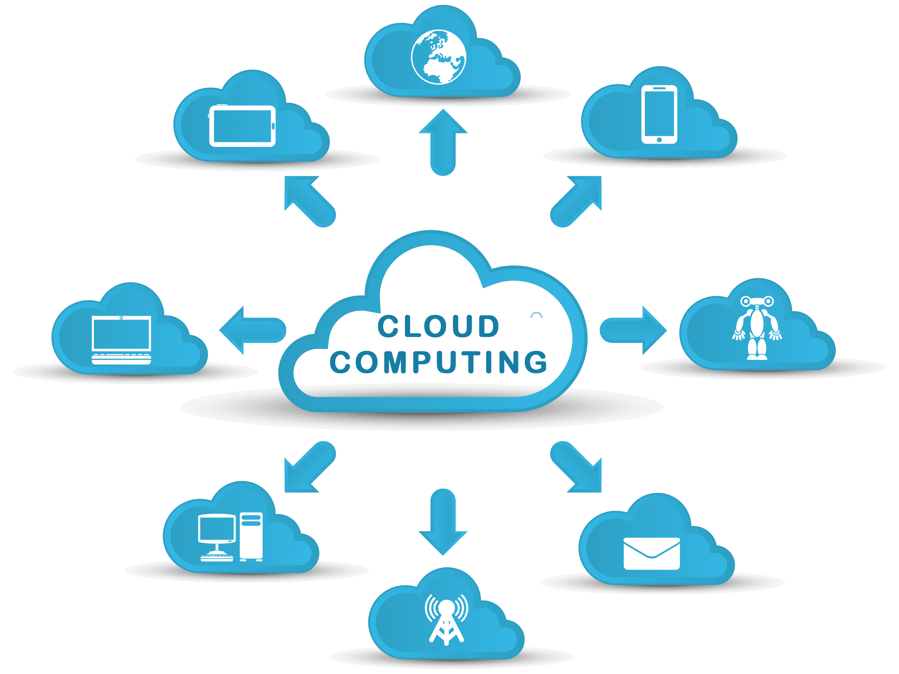
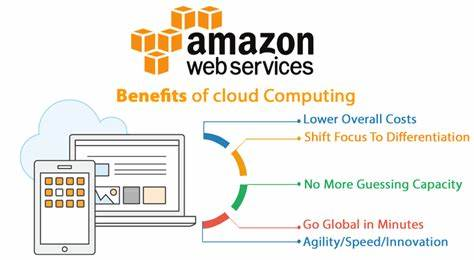
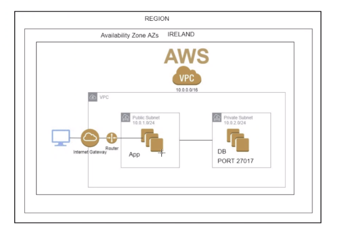
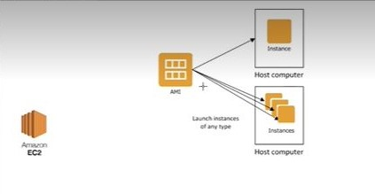

# Cloud_Computing_with_AWS
Introduction to Cloud Computing and AWS

## What is Cloud Computing?

- **Cloud computing** is the *delivery of computing resources, such as servers, storage, databases, software, and networking, over the internet*. 

It allows individuals and organizations to *access and use computing resources as a service, rather than owning and managing their own physical infrastructure*.

- In cloud computing, these *resources are provided by third-party service providers who maintain and manage the infrastructure*, while the users can access and use the resources on a **pay-per-use or subscription basis**. The users can *scale up or down the resources as needed, without the need to invest in and manage their own hardware and software*.

- Cloud computing provides several benefits, such as **increased agility, scalability, reliability, security, and cost-efficiency**. It is widely used by individuals, small and medium-sized businesses, and large enterprises for a variety of purposes, such as *data storage, application development, disaster recovery, and machine learning*.

## What is AWS?

- **AWS stands for Amazon Web Services**, which is a *cloud computing platform offered by Amazon*. AWS provides a wide *range of cloud-based computing services, including storage, databases, computing power, analytics, machine learning, and more*. 
- These services are provided on a **pay-as-you-go basis**, allowing organizations to *easily scale up or down as needed*. **AWS is a popular choice for businesses of all sizes due to its flexibility, reliability, and security features**. With AWS, organizations can *store and process large amounts of data, build and run applications, and easily deploy and manage their infrastructure*. 
- AWS is also known for its **broad global footprint**, providing a *presence in multiple geographic regions to enable low-latency access for users around the world*.

 

## Types of Cloud and Cloud Services:

- The three main types of cloud service are:

1. **Infrastructure as a Service (IaaS)**: Provides *virtualized computing resources, such as servers, storage, and networking, that can be rented and accessed over the internet*. With IaaS, **users are responsible for managing and securing their own applications and data**.

2. **Platform as a Service (PaaS)**: Provides a *platform for building and deploying software applications without the need to manage the underlying infrastructure*. PaaS typically includes *application development tools, databases, and middleware*.

3. **Software as a Service (SaaS)**: Provides access to *software applications over the internet, with the infrastructure and maintenance handled by the service provider*. SaaS *applications are typically accessed through a web browser*.

- The main differences between these three types of cloud service are the **level of control and responsibility that the user has over the underlying infrastructure**. With IaaS, the user has the most control over the infrastructure, but also has the most responsibility for managing it. With PaaS, the user has less control over the infrastructure, but can focus more on building and deploying applications. With SaaS, the user has the least control over the infrastructure, but can simply use the software application without worrying about infrastructure or maintenance.

- Additionally, there are different deployment models for cloud services, including public, private, and hybrid cloud. 
1. Public cloud services are available to the general public and are owned and operated by a third-party cloud provider. 
2. Private cloud services are used by a single organization and are typically managed in-house or by a third-party service provider. 
3. Hybrid cloud services are a combination of public and private cloud, providing the benefits of both.

## CapEx vs OpEx:

CapEx and OpEx are two different types of expenses that organizations can incur.

- CapEx (Capital Expenditure) refers to the expenses incurred by an organization to purchase, upgrade, or improve a long-term asset, such as property, equipment, or a building. CapEx is considered an investment in the business and is typically recorded on the balance sheet as an asset. These assets are expected to provide value to the organization over an extended period, often several years. CapEx expenses are usually one-time or periodic expenses that have a significant impact on the organization's finances.

- OpEx (Operational Expenditure) refers to the ongoing, day-to-day expenses incurred by an organization to run its business, such as rent, utilities, wages, and supplies. OpEx is a recurring expense that is recorded on the income statement and is deducted from revenue to calculate the organization's profits or losses. Unlike CapEx, OpEx expenses are typically incurred on a regular basis, such as monthly or quarterly.

Organizations need to balance their CapEx and OpEx expenses to maintain financial stability and sustainability. Generally, CapEx expenses are used to improve or expand the business, while OpEx expenses are used to sustain the current business operations.

---

## Tier 2 Architecture

A tier 2 architecture, also known as a two-tier architecture or a client-server architecture, is a software architecture that divides an application into two main layers: the presentation layer, also known as the client, and the data management layer, also known as the server.

The presentation layer is responsible for user interaction and is typically composed of a graphical user interface (GUI) that runs on a client device, such as a desktop computer or a mobile phone. The GUI communicates with the data management layer to perform operations and retrieve data.

The data management layer is responsible for managing the application's data and performing business logic. It typically runs on a server or a cluster of servers and can handle multiple client connections simultaneously. This layer is responsible for storing, retrieving, and modifying data, and may also include components for security, transaction management, and other system-level services.

In a tier 2 architecture, the presentation layer and the data management layer are typically connected using a network protocol, such as HTTP or TCP/IP. The client sends requests to the server, which processes the requests and returns responses to the client. This separation of concerns between the client and server allows for greater scalability, flexibility, and maintainability of the application.

---

There are several reasons why a company might consider migrating from a monolithic architecture to a tier 2 architecture:

1. Scalability: Monolithic architectures are typically designed to run on a single server or a small cluster of servers, which can limit their ability to handle increased traffic or data processing demands. In contrast, tier 2 architectures can be easily scaled horizontally by adding more servers to the pool, allowing them to handle much higher workloads.

2. Resilience: Monolithic architectures can be more susceptible to downtime, as any issues with the application can affect the entire system. In a tier 2 architecture, components are decoupled and can be designed to handle failures independently, making the overall system more resilient.

3. Maintainability: Monolithic architectures can be challenging to maintain and upgrade, as changes to one component can have unintended consequences for the rest of the system. In contrast, tier 2 architectures allow for more modular development, making it easier to add or modify specific components without affecting the entire system.

4. Flexibility: Tier 2 architectures can allow for more flexibility in the choice of programming languages, databases, and other components, making it easier to adopt new technologies or integrate with other systems

5. Team Organization: Monolithic architectures may require larger and more complex teams to maintain the system as a whole, whereas a tier 2 architecture allows for teams to be organized around smaller, more focused components.

Overall, a migration from a monolithic architecture to a tier 2 architecture can offer several benefits in terms of scalability, resilience, maintainability, flexibility, and team organization. However, it's important to note that the migration process itself can be complex and time-consuming, so careful planning and execution are necessary to ensure a successful transition.

---
### How Does refactoring a monolith architecture into a 2tier architecture fit into DevOps and Agile

- Refactoring a monolith into a tier 2 architecture can be a significant part of a DevOps strategy. DevOps is a software development methodology that emphasizes collaboration between development teams and operations teams, and aims to streamline the software development and delivery process. Refactoring a monolith into a tier 2 architecture can help facilitate this process in several ways:

1. Continuous Integration and Deployment: By breaking down the monolith into smaller, more manageable components, it becomes easier to integrate and deploy changes to the application. This can help enable continuous integration and deployment, which are key aspects of a DevOps strategy.

2. Automation: DevOps relies heavily on automation to streamline the software development and delivery process. Refactoring a monolith into a tier 2 architecture can help facilitate automation by making it easier to manage and deploy individual components, and by allowing for the use of tools and technologies that are specific to each component.

3. Collaboration: DevOps emphasizes collaboration between development and operations teams. Refactoring a monolith into a tier 2 architecture can help facilitate this collaboration by breaking down the application into smaller, more manageable components, which can be worked on and deployed by smaller teams that are focused on specific areas of the application.

4. Scalability: As mentioned earlier, a tier 2 architecture can be more scalable than a monolithic architecture, which can help support the rapid growth and changes that are often required in a DevOps environment.

Overall, refactoring a monolith into a tier 2 architecture can be an important part of a DevOps strategy, as it can help enable continuous integration and deployment, automation, collaboration, and scalability.

Refactoring a monolith into a tier 2 architecture can also fit into Agile or Scrum frameworks. Agile and Scrum are iterative and incremental software development methodologies that emphasize collaboration, flexibility, and delivering working software frequently.

Refactoring a monolith into a tier 2 architecture can help support these methodologies in several ways:

1. Flexibility: In an Agile or Scrum environment, requirements and priorities can change frequently. Refactoring a monolith into a tier 2 architecture can make it easier to accommodate these changes, as each component can be developed and deployed independently of the others.

2. Collaborative Development: Agile and Scrum emphasize collaboration between development teams and stakeholders. Refactoring a monolith into a tier 2 architecture can help facilitate this collaboration by breaking down the application into smaller, more manageable components that can be worked on by smaller, cross-functional teams.

3. Iterative and Incremental Development: In Agile and Scrum, development is done in small iterations or sprints. Refactoring a monolith into a tier 2 architecture can help enable this iterative and incremental development by breaking down the application into smaller components that can be developed and tested in isolation.

4. Delivering Working Software Frequently: In Agile and Scrum, the goal is to deliver working software frequently. Refactoring a monolith into a tier 2 architecture can help enable this by making it easier to deploy individual components independently of each other.

Overall, refactoring a monolith into a tier 2 architecture can be an important part of an Agile or Scrum framework, as it can help support flexibility, collaborative development, iterative and incremental development, and delivering working software frequently.

---

## AMI (Amazon Machine Image)

 An ***AMI*** is a **pre-configured virtual machine image used to create EC2 (Elastic Compute Cloud) instances in Amazon Web Services (AWS)**. An AMI contains an *operating system, application server, and other required software components needed to launch an EC2 instance*.

- AMIs are **used to create virtual servers quickly and efficiently in the cloud**. 
- AWS provides a wide variety of pre-configured AMIs for popular operating systems and software applications.

!!! **Note**: *Users can also create their own customized AMIs based on their specific requirements*.

- When launching an EC2 instance, users can *choose the AMI that best meets their needs*. The **instance will then be launched with the specified operating system, applications, and other software components configured in the selected AMI**. 
- AMIs can **save users a significant amount of time and effort in setting up and configuring servers in the cloud**.

