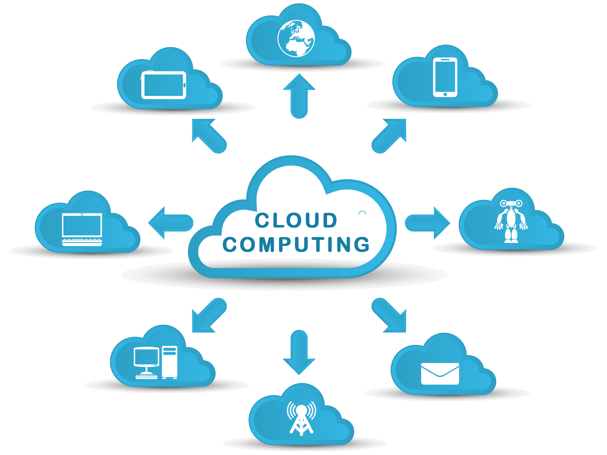
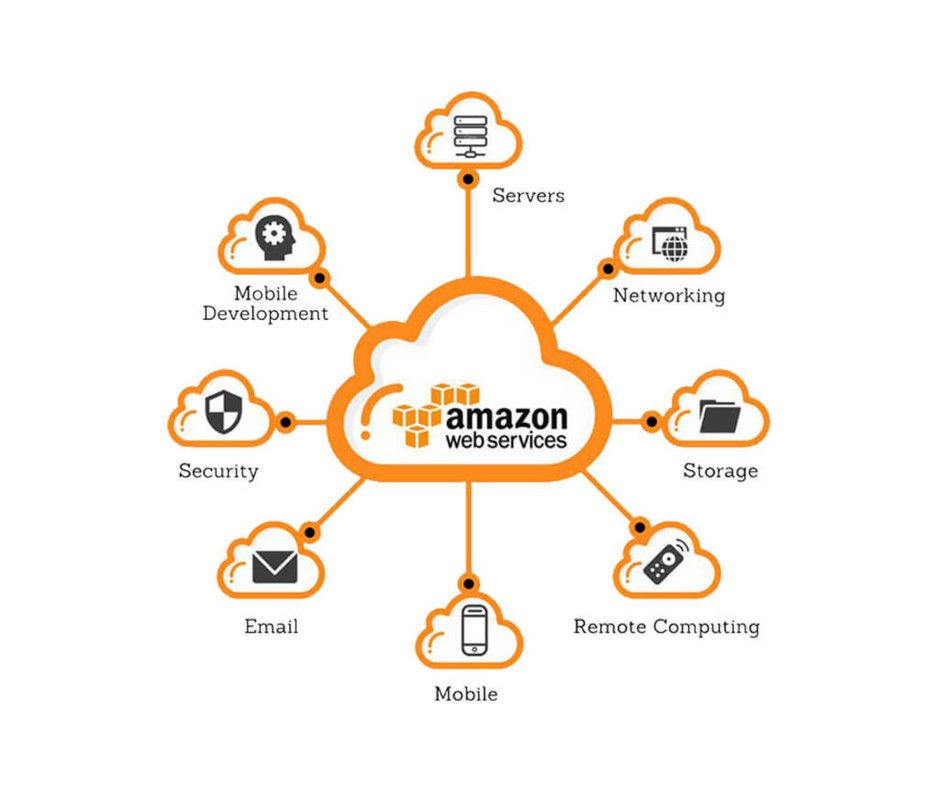
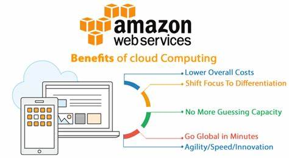
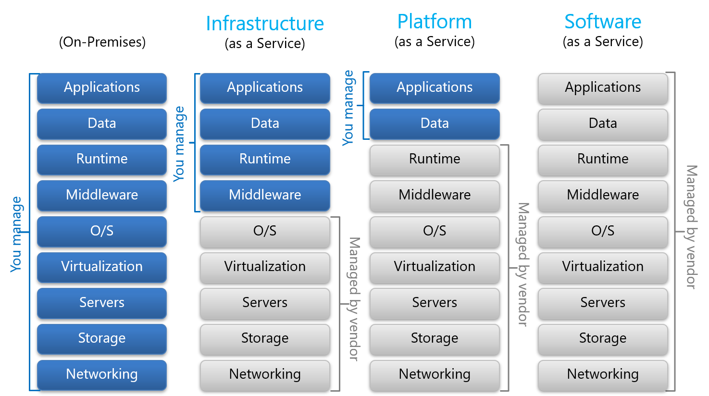

# Cloud_Computing_with_AWS
Introduction to Cloud Computing and AWS

## What is Cloud Computing?

- **Cloud computing** is the *delivery of computing resources, such as servers, storage, databases, software, and networking, over the internet*. 

It allows individuals and organizations to *access and use computing resources as a service, rather than owning and managing their own physical infrastructure*.

- In cloud computing, these *resources are provided by third-party service providers who maintain and manage the infrastructure*, while the users can access and use the resources on a **pay-per-use or subscription basis**. The users can *scale up or down the resources as needed, without the need to invest in and manage their own hardware and software*.

- Cloud computing provides several benefits, such as **increased agility, scalability, reliability, security, and cost-efficiency**. It is widely used by individuals, small and medium-sized businesses, and large enterprises for a variety of purposes, such as *data storage, application development, disaster recovery, and machine learning*.

## What is AWS?

- **AWS stands for Amazon Web Services**, which is a *cloud computing platform offered by Amazon*. AWS provides a wide *range of cloud-based computing services, including storage, databases, computing power, analytics, machine learning, and more*. 
- These services are provided on a **pay-as-you-go basis**, allowing organizations to *easily scale up or down as needed*. **AWS is a popular choice for businesses of all sizes due to its flexibility, reliability, and security features**. With AWS, organizations can *store and process large amounts of data, build and run applications, and easily deploy and manage their infrastructure*. 
- AWS is also known for its **broad global footprint**, providing a *presence in multiple geographic regions to enable low-latency access for users around the world*.

 

## Types of Cloud and Cloud Services:

- The three main types of cloud service are:

1. **Infrastructure as a Service (IaaS)**: Provides *virtualized computing resources, such as servers, storage, and networking, that can be rented and accessed over the internet*. With IaaS, **users are responsible for managing and securing their own applications and data**.

2. **Platform as a Service (PaaS)**: Provides a *platform for building and deploying software applications without the need to manage the underlying infrastructure*. PaaS typically includes *application development tools, databases, and middleware*.

3. **Software as a Service (SaaS)**: Provides access to *software applications over the internet, with the infrastructure and maintenance handled by the service provider*. SaaS *applications are typically accessed through a web browser*.

- The main differences between these three types of cloud service are the **level of control and responsibility that the user has over the underlying infrastructure**. With IaaS, the user has the most control over the infrastructure, but also has the most responsibility for managing it. With PaaS, the user has less control over the infrastructure, but can focus more on building and deploying applications. With SaaS, the user has the least control over the infrastructure, but can simply use the software application without worrying about infrastructure or maintenance.

- Additionally, there are different deployment models for cloud services, including public, private, and hybrid cloud. 
1. Public cloud services are available to the general public and are owned and operated by a third-party cloud provider. 
2. Private cloud services are used by a single organization and are typically managed in-house or by a third-party service provider. 
3. Hybrid cloud services are a combination of public and private cloud, providing the benefits of both.

## CapEx vs OpEx:

CapEx and OpEx are two different types of expenses that organizations can incur.

- CapEx (Capital Expenditure) refers to the expenses incurred by an organization to purchase, upgrade, or improve a long-term asset, such as property, equipment, or a building. CapEx is considered an investment in the business and is typically recorded on the balance sheet as an asset. These assets are expected to provide value to the organization over an extended period, often several years. CapEx expenses are usually one-time or periodic expenses that have a significant impact on the organization's finances.

- OpEx (Operational Expenditure) refers to the ongoing, day-to-day expenses incurred by an organization to run its business, such as rent, utilities, wages, and supplies. OpEx is a recurring expense that is recorded on the income statement and is deducted from revenue to calculate the organization's profits or losses. Unlike CapEx, OpEx expenses are typically incurred on a regular basis, such as monthly or quarterly.

Organizations need to balance their CapEx and OpEx expenses to maintain financial stability and sustainability. Generally, CapEx expenses are used to improve or expand the business, while OpEx expenses are used to sustain the current business operations.