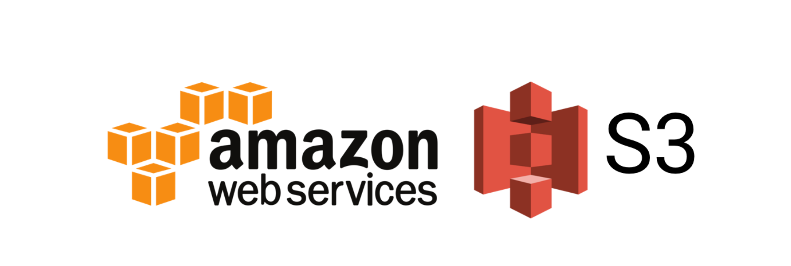

# Cloud_Computing_with_AWS
Introduction to Cloud Computing and AWS

## What is Cloud Computing?

- **Cloud computing** is the *delivery of computing resources, such as servers, storage, databases, software, and networking, over the internet*. 

It allows individuals and organizations to *access and use computing resources as a service, rather than owning and managing their own physical infrastructure*.

- In cloud computing, these *resources are provided by third-party service providers who maintain and manage the infrastructure*, while the users can access and use the resources on a **pay-per-use or subscription basis**. The users can *scale up or down the resources as needed, without the need to invest in and manage their own hardware and software*.

- Cloud computing provides several benefits, such as **increased agility, scalability, reliability, security, and cost-efficiency**. It is widely used by individuals, small and medium-sized businesses, and large enterprises for a variety of purposes, such as *data storage, application development, disaster recovery, and machine learning*.

## What is AWS?

- **AWS stands for Amazon Web Services**, which is a *cloud computing platform offered by Amazon*. AWS provides a wide *range of cloud-based computing services, including storage, databases, computing power, analytics, machine learning, and more*. 
- These services are provided on a **pay-as-you-go basis**, allowing organizations to *easily scale up or down as needed*. **AWS is a popular choice for businesses of all sizes due to its flexibility, reliability, and security features**. With AWS, organizations can *store and process large amounts of data, build and run applications, and easily deploy and manage their infrastructure*. 
- AWS is also known for its **broad global footprint**, providing a *presence in multiple geographic regions to enable low-latency access for users around the world*.

 

## Types of Cloud and Cloud Services:

- The three main types of cloud service are:

1. **Infrastructure as a Service (IaaS)**: Provides *virtualized computing resources, such as servers, storage, and networking, that can be rented and accessed over the internet*. With IaaS, **users are responsible for managing and securing their own applications and data**.

2. **Platform as a Service (PaaS)**: Provides a *platform for building and deploying software applications without the need to manage the underlying infrastructure*. PaaS typically includes *application development tools, databases, and middleware*.

3. **Software as a Service (SaaS)**: Provides access to *software applications over the internet, with the infrastructure and maintenance handled by the service provider*. SaaS *applications are typically accessed through a web browser*.

- The main differences between these three types of cloud service are the **level of control and responsibility that the user has over the underlying infrastructure**. With IaaS, the user has the most control over the infrastructure, but also has the most responsibility for managing it. With PaaS, the user has less control over the infrastructure, but can focus more on building and deploying applications. With SaaS, the user has the least control over the infrastructure, but can simply use the software application without worrying about infrastructure or maintenance.

- Additionally, there are different deployment models for cloud services, including public, private, and hybrid cloud. 
1. Public cloud services are available to the general public and are owned and operated by a third-party cloud provider. 
2. Private cloud services are used by a single organization and are typically managed in-house or by a third-party service provider. 
3. Hybrid cloud services are a combination of public and private cloud, providing the benefits of both.

## CapEx vs OpEx:

CapEx and OpEx are two different types of expenses that organizations can incur.

- CapEx (Capital Expenditure) refers to the expenses incurred by an organization to purchase, upgrade, or improve a long-term asset, such as property, equipment, or a building. CapEx is considered an investment in the business and is typically recorded on the balance sheet as an asset. These assets are expected to provide value to the organization over an extended period, often several years. CapEx expenses are usually one-time or periodic expenses that have a significant impact on the organization's finances.

- OpEx (Operational Expenditure) refers to the ongoing, day-to-day expenses incurred by an organization to run its business, such as rent, utilities, wages, and supplies. OpEx is a recurring expense that is recorded on the income statement and is deducted from revenue to calculate the organization's profits or losses. Unlike CapEx, OpEx expenses are typically incurred on a regular basis, such as monthly or quarterly.

Organizations need to balance their CapEx and OpEx expenses to maintain financial stability and sustainability. Generally, CapEx expenses are used to improve or expand the business, while OpEx expenses are used to sustain the current business operations.

---

## Tier 2 Architecture

A tier 2 architecture, also known as a two-tier architecture or a client-server architecture, is a software architecture that divides an application into two main layers: the presentation layer, also known as the client, and the data management layer, also known as the server.

The presentation layer is responsible for user interaction and is typically composed of a graphical user interface (GUI) that runs on a client device, such as a desktop computer or a mobile phone. The GUI communicates with the data management layer to perform operations and retrieve data.

The data management layer is responsible for managing the application's data and performing business logic. It typically runs on a server or a cluster of servers and can handle multiple client connections simultaneously. This layer is responsible for storing, retrieving, and modifying data, and may also include components for security, transaction management, and other system-level services.

In a tier 2 architecture, the presentation layer and the data management layer are typically connected using a network protocol, such as HTTP or TCP/IP. The client sends requests to the server, which processes the requests and returns responses to the client. This separation of concerns between the client and server allows for greater scalability, flexibility, and maintainability of the application.

---

There are several reasons why a company might consider migrating from a monolithic architecture to a tier 2 architecture:

1. Scalability: Monolithic architectures are typically designed to run on a single server or a small cluster of servers, which can limit their ability to handle increased traffic or data processing demands. In contrast, tier 2 architectures can be easily scaled horizontally by adding more servers to the pool, allowing them to handle much higher workloads.

2. Resilience: Monolithic architectures can be more susceptible to downtime, as any issues with the application can affect the entire system. In a tier 2 architecture, components are decoupled and can be designed to handle failures independently, making the overall system more resilient.

3. Maintainability: Monolithic architectures can be challenging to maintain and upgrade, as changes to one component can have unintended consequences for the rest of the system. In contrast, tier 2 architectures allow for more modular development, making it easier to add or modify specific components without affecting the entire system.

4. Flexibility: Tier 2 architectures can allow for more flexibility in the choice of programming languages, databases, and other components, making it easier to adopt new technologies or integrate with other systems

5. Team Organization: Monolithic architectures may require larger and more complex teams to maintain the system as a whole, whereas a tier 2 architecture allows for teams to be organized around smaller, more focused components.

Overall, a migration from a monolithic architecture to a tier 2 architecture can offer several benefits in terms of scalability, resilience, maintainability, flexibility, and team organization. However, it's important to note that the migration process itself can be complex and time-consuming, so careful planning and execution are necessary to ensure a successful transition.

---
### How Does refactoring a monolith architecture into a 2tier architecture fit into DevOps and Agile

- Refactoring a monolith into a tier 2 architecture can be a significant part of a DevOps strategy. DevOps is a software development methodology that emphasizes collaboration between development teams and operations teams, and aims to streamline the software development and delivery process. Refactoring a monolith into a tier 2 architecture can help facilitate this process in several ways:

1. Continuous Integration and Deployment: By breaking down the monolith into smaller, more manageable components, it becomes easier to integrate and deploy changes to the application. This can help enable continuous integration and deployment, which are key aspects of a DevOps strategy.

2. Automation: DevOps relies heavily on automation to streamline the software development and delivery process. Refactoring a monolith into a tier 2 architecture can help facilitate automation by making it easier to manage and deploy individual components, and by allowing for the use of tools and technologies that are specific to each component.

3. Collaboration: DevOps emphasizes collaboration between development and operations teams. Refactoring a monolith into a tier 2 architecture can help facilitate this collaboration by breaking down the application into smaller, more manageable components, which can be worked on and deployed by smaller teams that are focused on specific areas of the application.

4. Scalability: As mentioned earlier, a tier 2 architecture can be more scalable than a monolithic architecture, which can help support the rapid growth and changes that are often required in a DevOps environment.

Overall, refactoring a monolith into a tier 2 architecture can be an important part of a DevOps strategy, as it can help enable continuous integration and deployment, automation, collaboration, and scalability.

Refactoring a monolith into a tier 2 architecture can also fit into Agile or Scrum frameworks. Agile and Scrum are iterative and incremental software development methodologies that emphasize collaboration, flexibility, and delivering working software frequently.

Refactoring a monolith into a tier 2 architecture can help support these methodologies in several ways:

1. Flexibility: In an Agile or Scrum environment, requirements and priorities can change frequently. Refactoring a monolith into a tier 2 architecture can make it easier to accommodate these changes, as each component can be developed and deployed independently of the others.

2. Collaborative Development: Agile and Scrum emphasize collaboration between development teams and stakeholders. Refactoring a monolith into a tier 2 architecture can help facilitate this collaboration by breaking down the application into smaller, more manageable components that can be worked on by smaller, cross-functional teams.

3. Iterative and Incremental Development: In Agile and Scrum, development is done in small iterations or sprints. Refactoring a monolith into a tier 2 architecture can help enable this iterative and incremental development by breaking down the application into smaller components that can be developed and tested in isolation.

4. Delivering Working Software Frequently: In Agile and Scrum, the goal is to deliver working software frequently. Refactoring a monolith into a tier 2 architecture can help enable this by making it easier to deploy individual components independently of each other.

Overall, refactoring a monolith into a tier 2 architecture can be an important part of an Agile or Scrum framework, as it can help support flexibility, collaborative development, iterative and incremental development, and delivering working software frequently.

---

## AMI (Amazon Machine Image)

 An ***AMI*** is a **pre-configured virtual machine image used to create EC2 (Elastic Compute Cloud) instances in Amazon Web Services (AWS)**. An AMI contains an *operating system, application server, and other required software components needed to launch an EC2 instance*.

- AMIs are **used to create virtual servers quickly and efficiently in the cloud**. 
- AWS provides a wide variety of pre-configured AMIs for popular operating systems and software applications.

!!! **Note**: *Users can also create their own customized AMIs based on their specific requirements*.

- When launching an EC2 instance, users can *choose the AMI that best meets their needs*. The **instance will then be launched with the specified operating system, applications, and other software components configured in the selected AMI**. 
- AMIs can **save users a significant amount of time and effort in setting up and configuring servers in the cloud**.

---

## Monitoring and alerting - AWS CloudWatch

***Amazon CloudWatch** is a **monitoring and logging service provided by Amazon Web Services (AWS)**. It is designed to *monitor, store, and access various metrics, logs, and events from AWS resources and applications in real-time*. 
- **CloudWatch** *provides data and actionable insights that help you identify issues, troubleshoot problems, and optimize resource utilization across your entire AWS infrastructure.*

- CloudWatch collects metrics such as CPU utilization, network traffic, and disk usage, from various AWS resources like EC2 instances, RDS databases, and Lambda functions, as well as from custom applications running on AWS or on-premises. These metrics are stored for a period of up to 15 months, and can be visualized on custom dashboards, alarms can be set up to notify users when certain thresholds are crossed.

- In addition to metrics, CloudWatch can also capture and store log files generated by applications and systems, which can be searched, analyzed, and monitored in real-time. 
- It can also monitor and respond to events within your infrastructure, such as changes in resource state or security group changes.

Overall, **AWS CloudWatch** provides a *comprehensive monitoring and logging solution for your AWS resources*, allowing you to **improve application performance, reduce downtime, and optimize resource utilization**.

---

## S3 (Simple storage service)

**Amazon S3 (Simple Storage Service)** is a *highly scalable and secure object storage service* provided by Amazon Web Services (AWS). 

- **S3** is designed to **store and retrieve any amount of data from anywhere on the internet**, making it ideal for a wide range of use cases such as backup and recovery, content distribution, big data analytics, and archiving.

- **S3** stores data as objects, which can be any type of file, including **text files, images, videos, and documents**. *Each object is identified by a unique key*, which can be used to retrieve the object from S3.

- S3 provides several features that make it a **highly reliable and secure storage solution**:

a. versioning

b. encryption

c. access control

d. lifecycle policies. 

- It is also **highly scalable, allowing users to store and retrieve virtually unlimited amounts of data**, and it can be accessed using a wide range of tools and technologies, including AWS Management Console, command-line tools, and software development kits (SDKs) for popular programming languages.

### Some of the main benefits of Amazon S3 (Simple Storage Service)

- **Highly scalable**: S3 can scale to store and retrieve virtually unlimited amounts of data, making it suitable for small as well as large-scale applications.

- **Durability and availability**: S3 stores data redundantly across multiple availability zones (AZs), ensuring high durability and availability of stored data.

- **Cost-effective**: S3 offers a pay-as-you-go pricing model, which allows users to pay only for the storage they consume, without any upfront costs or long-term commitments.

- **Flexible data management**: S3 provides flexible data management features such as versioning, lifecycle policies, and access controls, which enable users to manage their data effectively and securely.

- **Security**: S3 provides robust security features such as encryption, access controls, and multi-factor authentication, which ensure the privacy and security of stored data.

- **Integration with other AWS services**: S3 integrates seamlessly with other AWS services such as EC2, Glacier, and CloudFront, enabling users to build scalable and reliable applications.

- **Global accessibility**: S3 allows users to store and retrieve data from anywhere on the internet, making it accessible globally.

### Amazon S3 disaster recovery 

Ensures the availability and durability of data in case of a disaster. Here are some of the ways in which S3 can be used for disaster recovery:

- **Cross-region replication**: S3 allows users to replicate data across multiple regions, providing a high level of durability and availability. In case of a disaster in one region, data can be quickly recovered from the replicated data in another region.

- **Versioning**: S3 supports versioning, which allows users to store multiple versions of an object. In case of accidental deletion or modification of an object, users can restore the previous version, ensuring data recovery.

- **Lifecycle policies**: S3 allows users to define lifecycle policies to automatically transition objects to other storage classes or delete them after a certain period. This ensures that data is stored efficiently and cost-effectively while providing data recovery options.

- **Cross-account replication**: S3 allows users to replicate data across AWS accounts, providing an additional layer of protection against data loss in case of a disaster.

- **Object lock**: S3 supports object lock, which enables users to protect objects from deletion or modification for a specific retention period. This provides an additional layer of protection against accidental or intentional deletion of data.

!! Note: In addition to these features, S3 also provides a **highly durable and available storage infrastructure**, which is *designed to withstand multiple failures and provide high levels of data durability and availability*.

### Best use cases for Amazon S3

- **Backup and recovery**: S3 can be used for backup and recovery of critical data, ensuring that data is stored securely and can be recovered quickly in case of a disaster.

- **Archiving**: S3 provides a cost-effective and secure way to store and manage archival data, such as historical records and logs, which may not be accessed frequently but need to be stored for a long time.

- **Big data analytics**: S3 can be used to store large amounts of data, such as log files and sensor data, for big data analytics. S3 integrates with AWS services such as Amazon EMR and Amazon Athena, making it easy to process and analyze large datasets.

- **Content distribution**: S3 can be used to store and distribute static content, such as images, videos, and web pages, using AWS CloudFront. This enables fast and secure delivery of content to users worldwide.

- **Disaster recovery**: S3 can be used for disaster recovery by replicating data across multiple regions or accounts, ensuring the availability and durability of data in case of a disaster.

- **Hybrid cloud storage**: S3 can be used as a hybrid cloud storage solution, enabling users to store and manage data on-premises and in the cloud using AWS Storage Gateway.

- **Application storage**: S3 can be used to store and manage data for cloud-native applications, such as mobile and web applications, providing a scalable and secure storage infrastructure.

### S3 High Availability

S3 is designed to provide **high availability and durability of stored data, with multiple layers of redundancy and failover mechanisms**. This ensures that data is always available, even in case of component failures, regional outages, or disasters.

- **Redundant storage**: S3 stores data redundantly across multiple availability zones (AZs) within a region. Each AZ is physically isolated and designed to be independent of other AZs, providing a high level of fault tolerance and availability.

- **Object durability**: S3 provides high object durability, with a durability rating of 99.999999999% (11 9's). This means that S3 is designed to tolerate multiple component failures and provide high durability and availability of stored data.

- **Data replication**: S3 allows users to replicate data across multiple regions or accounts, providing additional layers of redundancy and availability. This ensures that data is available even in case of a regional outage or disaster.

- **Automatic failover**: S3 uses automatic failover to redirect traffic to a healthy instance in case of a failure, providing seamless access to data without any interruption.

- **Load balancing**: S3 uses load balancing to distribute traffic across multiple instances, ensuring that the workload is evenly distributed and resources are used efficiently.

- **Monitoring and alerting**: S3 provides monitoring and alerting features, which allow users to monitor the health and performance of their S3 instances and get alerts in case of any issues.

### S3 as Social media storage 

Amazon S3 (Simple Storage Service) can be used as a highly scalable and cost-effective storage solution for social media applications. Social media platforms generate a massive amount of data in the form of photos, videos, posts, and user-generated content. Here are some of the ways in which S3 can be used for social media storage:

- **Scalable storage**: S3 provides virtually unlimited storage capacity, allowing social media platforms to store and manage large amounts of data generated by their users.

- **Highly available**

- **Cost-effective**: S3 provides a cost-effective storage solution, with pay-as-you-go pricing and no upfront costs. This makes it easy for social media platforms to manage their storage costs while scaling their storage infrastructure as needed.

- **Content delivery**: S3 integrates with Amazon CloudFront, a content delivery network (CDN) service, allowing social media platforms to deliver content to their users quickly and securely.

- **Data analytics**: S3 integrates with AWS services such as Amazon Athena and Amazon EMR, providing powerful data analytics capabilities. Social media platforms can use these services to analyze user data and gain insights into user behavior and preferences.

- **Security**

Overall, S3 provides a highly scalable, cost-effective, and secure storage solution for social media platforms, enabling them to store and manage large amounts of user-generated content while providing high availability and durability.

---

## EC2 Autoscaling

**Amazon EC2 Auto Scaling** helps you ensure that you have the *correct number of Amazon EC2 instances available to handle the load for your application*. 

You create collections of EC2 instances, called Auto Scaling groups. 
- You can specify the minimum number of instances in each Auto Scaling group, and Amazon EC2 Auto Scaling ensures that your group never goes below this size. 
- You can specify the maximum number of instances in each Auto Scaling group, and Amazon EC2 Auto Scaling ensures that your group never goes above this size. 
- If you specify the desired capacity, either when you create the group or at any time thereafter, Amazon EC2 Auto Scaling ensures that your group has this many instances. 
- If you specify scaling policies, then Amazon EC2 Auto Scaling can launch or terminate instances as demand on your application increases or decreases.

For example, the following Auto Scaling group has a minimum size of one instance, a desired capacity of two instances, and a maximum size of four instances. The scaling policies that you define adjust the number of instances, within your minimum and maximum number of instances, based on the criteria that you specify.

### Autoscaling components:
1. **Groups** - Your EC2 instances are organized into groups so that they can be treated as a logical unit for the purposes of scaling and management. When you create a group, you can specify its minimum, maximum, and, desired number of EC2 instances. 

2. **Configuration templates** - Your group uses a launch template, or a launch configuration (not recommended, offers fewer features), as a configuration template for its EC2 instances. You can specify information such as the AMI ID, instance type, key pair, security groups, and block device mapping for your instances.

3. **Scaling options** - Amazon EC2 Auto Scaling provides several ways for you to scale your Auto Scaling groups. For example, you can configure a group to scale based on the occurrence of specified conditions (dynamic scaling) or on a schedule.

### Elastic Load Balancer

Elastic Load Balancing automatically distributes your incoming application traffic across all the EC2 instances that you are running. Elastic Load Balancing helps to manage incoming requests by optimally routing traffic so that no one instance is overwhelmed.

To use Elastic Load Balancing with your Auto Scaling group, attach the load balancer to your Auto Scaling group. This registers the group with the load balancer, which acts as a single point of contact for all incoming web traffic to your Auto Scaling group.

When you use Elastic Load Balancing with your Auto Scaling group, it's not necessary to register individual EC2 instances with the load balancer. Instances that are launched by your Auto Scaling group are automatically registered with the load balancer. Likewise, instances that are terminated by your Auto Scaling group are automatically deregistered from the load balancer.

After attaching a load balancer to your Auto Scaling group, you can configure your Auto Scaling group to use Elastic Load Balancing metrics (such as the Application Load Balancer request count per target) to scale the number of instances in the group as demand fluctuates.

***Types of Elastic Load Balancer**

Elastic Load Balancing provides four types of load balancers that can be used with your Auto Scaling group: Application Load Balancers, Network Load Balancers, Gateway Load Balancers, and Classic Load Balancers.

There is a key difference in how the load balancer types are configured. With Application Load Balancers, Network Load Balancers, and Gateway Load Balancers, instances are registered as targets with a target group, and you route traffic to the target group. With Classic Load Balancers, instances are registered directly with the load balancer.

- **Application Load Balancer**

Routes and load balances at the application layer (HTTP/HTTPS), and supports path-based routing. An Application Load Balancer can route requests to ports on one or more registered targets, such as EC2 instances, in your virtual private cloud (VPC).

- **Network Load Balancer**
Routes and load balances at the transport layer (TCP/UDP Layer-4), based on address information extracted from the Layer-4 header. Network Load Balancers can handle traffic bursts, retain the source IP of the client, and use a fixed IP for the life of the load balancer.

- **Gateway Load Balancer**
Distributes traffic to a fleet of appliance instances. Provides scale, availability, and simplicity for third-party virtual appliances, such as firewalls, intrusion detection and prevention systems, and other appliances. Gateway Load Balancers work with virtual appliances that support the GENEVE protocol. Additional technical integration is required, so make sure to consult the user guide before choosing a Gateway Load Balancer.

- **Classic Load Balancer**
Routes and load balances either at the transport layer (TCP/SSL), or at the application layer (HTTP/HTTPS).