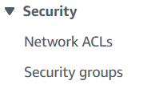
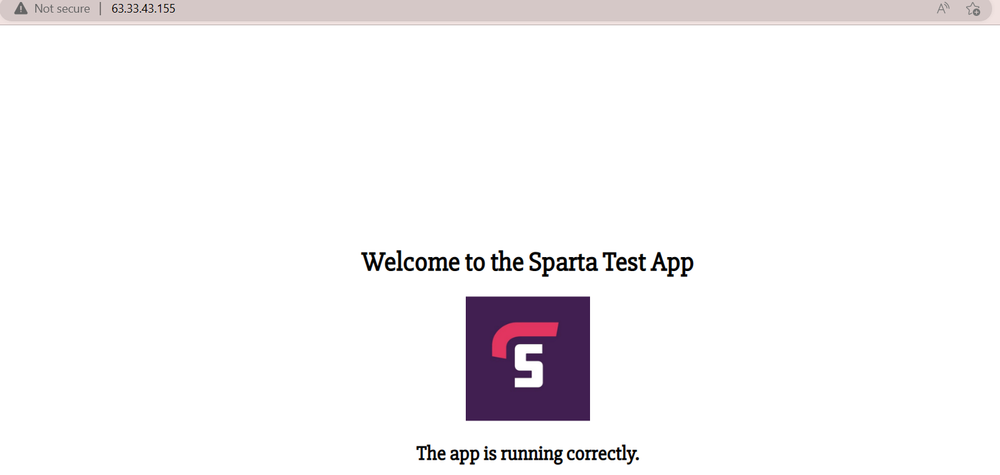
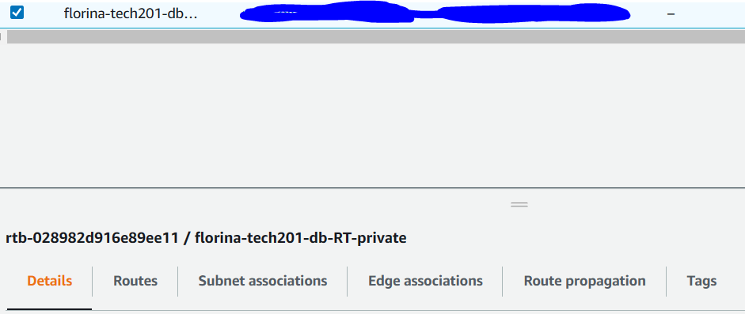
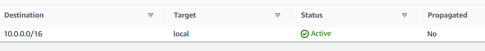
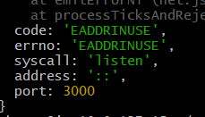
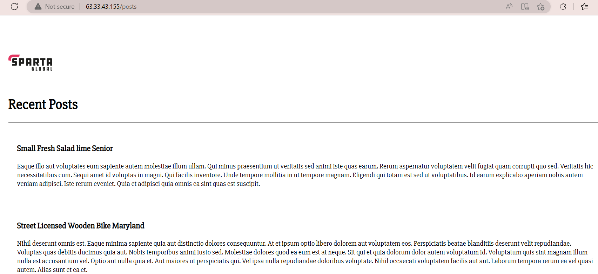

# VPCs

## What is VPC and what are its benefits?

A **VPC (Virtual Private Cloud)** is a *cloud computing service provided by companies like Amazon Web Services (AWS) that allows you to create a virtual network in the cloud*.

- Think of it as a private section of the cloud where you can launch your resources like servers, databases, and applications. 
- You can control the network settings, such as the IP address range, subnets, and routing, to create a customized network that fits your specific needs.

- The key benefit of using a VPC is that you can *create a secure and isolated environment for your resources in the cloud*, just like you would have in your own on-premise data center. 
- This allows you to keep your data and applications private and protected from the outside world, while still leveraging the scalability and flexibility of the cloud.

### AWS VPC

**AWS** introduced **VPC (Virtual Private Cloud)** in response to a *growing demand for more secure and customizable cloud environments*. 
- Prior to the introduction of VPC, AWS *customers had limited control over their network architecture in the cloud*. They had to use AWS-provided networking infrastructure, which was shared with other AWS customers.
- With VPC, AWS customers can create a private and secure network environment that is similar to an on-premises data center, while still benefiting from the scalability and cost-effectiveness of the cloud. 
- VPC also allows customers to connect their AWS resources to their own on-premises data centers using VPN or Direct Connect, providing a hybrid cloud environment.
---

## VPC and DevOps

**VPCs (Virtual Private Clouds)** can be very helpful for DevOps teams, as they provide a *secure and isolated environment in which to develop, test, and deploy applications*.

- Security: With a VPC, DevOps teams can control network access to their applications and data.
- Scalability: VPCs allow DevOps teams to scale their applications quickly and easily.
- Cost Optimization: VPCs can help DevOps teams optimize costs by allowing them to use only the resources they need. 
- Automation: VPCs can be automated using tools like AWS CloudFormation or Terraform, which can help DevOps teams to create and manage their VPC resources more efficiently.


---

## VPC Components

1. ***Subnets*** 
- In a VPC (Virtual Private Cloud), subnets are a way to partition the IP address space of the VPC into smaller networks. 
- A subnet is a range of IP addresses within the VPC CIDR block (the IP address range for the VPC), and is associated with a specific availability zone in the region.

a. **Public Subnets**
- Public subnets are subnets that have a route to the internet via an internet gateway. 
- Resources in a public subnet have a public IP address and can be accessed from the internet. 
- Public subnets are typically used for resources that need to be accessed from the internet, such as web servers or load balancers.

b .**Private Subnets**
- Private subnets, on the other hand, do not have a route to the internet.
- Resources in a private subnet can only be accessed from within the VPC or from a connected on-premises network.
- Private subnets are typically used for resources that do not need to be accessed from the internet, such as application servers or databases.

2. ***CIDR Block***
- CIDR (Classless Inter-Domain Routing) block is a range of IP addresses that are used to define the network address space for a VPC (Virtual Private Cloud) or a subnet within the VPC.

- A CIDR block is defined using a combination of an IP address and a subnet mask, expressed in CIDR notation.

** For example, a CIDR block of 10.0.0.0/16 represents the IP address range from 10.0.0.0 to 10.0.255.255.

3. ***Internet Gateway***
- An internet gateway is a horizontally scaled, redundant, and highly available component in AWS (Amazon Web Services) that allows resources within a VPC (Virtual Private Cloud) to access the internet. **It acts as a bridge between the VPC and the internet**.

** As an example, when you create a VPC in AWS, it is by default private, meaning that resources within the VPC cannot communicate with the internet. To enable internet access for resources within a VPC, you need to attach an internet gateway to the VPC.

4. ***Route table***
- In AWS (Amazon Web Services), a route table is a networking component that controls the traffic flow between subnets within a VPC (Virtual Private Cloud) or between a VPC and other networks, such as the internet or on-premises networks.

- Every subnet in a VPC must be associated with a route table, which contains a set of rules (called routes) that determine how traffic is directed between the subnets and other networks. When a packet of data is sent between two resources in a VPC, the route table is consulted to determine how the traffic should be routed.


---

# Creating our own VPC on AWS

- When creating a VPC we need to take it step by step, as there are a lot of moving parts and we need to make sure we cover everything correctly.


- This diagram showcases the steps we have to follow in order to be successful in creating our own VPC. Let`s get started!

1. Create the VPC.


- Select `VPC Only`.
- Select a name using the naimg convention `florina-tech201-vpc`.
- Introduce the IPV4 CIDR, in my case `10.0.0.0/16`.
- Select `No IPV6 BIDR Block`.
- Tenancy to be left as default.
- `Create VPC`.

2. Create an Internet Gateway.


- `Create Internet Gateway`.
- Name it using the naming convention, `florina_tech201_VCP_IG`.
- `Create Internet Gateway`.

3. Attach the IG to VPC.


- Select `Attach to VPC`.
- Select in `Available VPCs` the VPC you just created previously.
- `Attach Internet Gateway`.

4. Create a Subnet. 


- Click on `Create subnet`.
- On `VPC ID¬ select your VPC.
- On subnet settings, on subnet name, name it using the naming convention `florina-tech201-public-SN`.
- In IPV4 CIDR Block, select the subnet you created for yourself.

!! If unsure how to create a subnet, use the following calculator to create one.

[Subnet calculator](https://mxtoolbox.com/subnetcalculator.aspx)

- Select `create subnet`. 
- If you get an error, it means that your subnet is used already, so you have to try again with a different subnet.

5. Create a Route Table. 


- Select `Create route table`.
- Name it respecting the naming convention `florina-tech201-public-rt-acess`.
- Select the VPC you just created so you create the RT within the VPC.
- Select `Create route table`.

### Edit routes to lead the traffic to the internet gateway
- Go to `Subnet association` within the page of your newly created RT.


- Select `Edit subnet association`. 
- Select your subnet that we created earlier.
- select `Save association`.

### Edit routes to provide traffic to the Internet gateway 

- Go to `Routes` on the page of your newly create RT.


- Select `Edit routes`.
- Select `Add route`.
- On Destination, select `0.0.0.0/0` and on Target, select the Internet Gateway we just created. 
- This allows the resources to communicate amongst each other and allow acces to the internet.

---

## Deploying our 2Tier Architecture within our VPC

### Deploying our App instance
- We can use the steps described above (The Public subnet and Route table) to finalise the deployment of our App EC2.
- Once we have the public subnet and Route table that allows traffic from the internet, we need to create a security group and launch our EC2 instance.

1. Creating a security group for our app



- Select `Security Groups`.
- Select `Create Security Group`.
- Name it using the naming convention `florina-tech201-VPC-app-public-SG`.
- Copy and paste the name in the description.
- Select your own VPC.
- Rules: allow port 22 (My IP), port 80 (Anywhere), and port 3000 (Anywhere).
- Enable `Auto-assign public IP`.

2. Create our EC2 instance using the AMI of our working App VE.
- Go to EC2 Dashboard.
- Select `Launch instance`.
- Name it using the naming convention.
- Select the AMI.
- Select the Key pair.
- On `Network Settings`, select Edit. Select your own VPC, select the Public subnet we created, and lastly select the Security group we have just created in the previous step. 
- You can also add the user-data and specify, just like we previosuly did for Autoscaling groups, the commands for the system to run the app when booting up the EC2 instance.

```
#!/bin/bash

sudo apt update -y 
sudo apt upgrade -y

cd /home/ubuntu/app

nohup npm start 2>/dev/null 1>/dev/null&

```
- Select `Create instance`.

Now, if everything went well, you should be able to see your app up and running after the EC2 instance initialised. 



### Deploying our DB EC2 instance

1. Creating a Private subnet.
- Just like previously explained, in the VPC dashboard, go to `Subnets` and select `Create subnet`.
- Pick your VPC from the list.
- Name the subnet according to the naming convention `florina-tech201-private-SUBNET`.
- In the IPV4 CIDR Block, pick a subnet available within the range. This might take a lot of trial and error as most of them might already be in use.
- Select `create subnet`.

2. Creating a Route Table.
- Just like previously explaines, in the VPC Dashboard, go to `Route tables` and select `Create Route table`.
- Name it respecting the naming convention.
- Select your VPC from the list. 
- Select `Create route table`. 

** ***Subnet associations***
- Select your newly made Route table.
- Below it you can see different categories:



- Select `Subnet associations`.
- Further select `Edit subnet associations` and pick the private subnet we just created.
- Select `Save associations`.

- Go back to the Route table dashbpard, and this time pick `Routes`.
- This Route should only allow local acces for our private subnet, as we create a database on this subnet and we do not need the subnet to communicate with the internet. So, the Routes for this subnet should only look like this:



3. Creating a Security group.
- Just like explained previously, in the VPC Dashboard, go to `Security Groups`, and further select `Create security group`.
- Name it respecting the naming convention.
- Copy and paste the name in the description.
- Select your VPC from the list.
- Inbound rules: Allow port 22 (My IP) and port 27017-port to communicate with the database (Anywhere).
- Select `Create security group`.

4. Creating the EC2 instance from an AMI of our working DB.
- Just like explained previously, got to the EC2 Dashboard and select `Launch instance`. 
- Name it respeecting the naming convention.
- Select the AMI of your DB.
- Select the key pair.
- In `Network Settings` select Edit. Select your own VPC, the private subnet we created, `Disable` for `Auto-assign public IP`, Select the security group we have just created.
- Select `Launch instance`. 

## Connecting the 2 instances
- Once both our app and db instances are up and running, first we have to check that the app is running normally.
- So, copy and paste the IP address of the app in your browser and you should be able to see the app running normally.


- Now that we know that our app is running, we can ssh into our app EC2 instance to create the environmental variable so we can connect to the database.
- Once you ssh into the ap EC2 instance, we need to create the Evn variable using the private IP address of the DB.
```
export DB_HOST=mongodb://ipv4-private-address-of-DB-EC2-instance:27017/posts

printenv # to ensure our env variable has been created

cd app

npm install

node seeds/seed.js

node app.js
```
- Now, if we used user-data when we craeted our app instance to launch the app as soon as the EC2 instance is up and running, you might get the following error when running `node app.js`:



- If that is the case, this error is telling us that the port 3000 is used already, which means the app is already running.
- In this case we must kill the process that runs the app and restart it so it can use the env variable to establish the connection to the DB.

```
sudo lsof -i :3000 # otuputs the processes that use port 3000

sudo kill -9 PID of the process using port 3000
```
- Now, we can attempt again to run the app.

```
npm install

node seeds/seed.js

node app.js

```
- We should now be able to see the connection between the app and database when we request the app to print the posts from the database.



- Happy days! We have just deployed our 2Tier architecture within our VPC.
